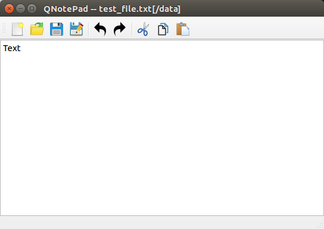

# QNotePad

QNotePad is a text editor fully written on Qt.

## Build notes

#### Clone repo

    $ git clone https://github.com/Rufaim/QNotePad.git
    $ cd QNotePad

#### Build

    $ mkdir build
    $ cd build
    $ qmake ../QNotePad.pro 
    $ make

#### Qt

This software was tested on Qt 5.13.

The latest version could be downloaded from [official website](https://www.qt.io/download).

